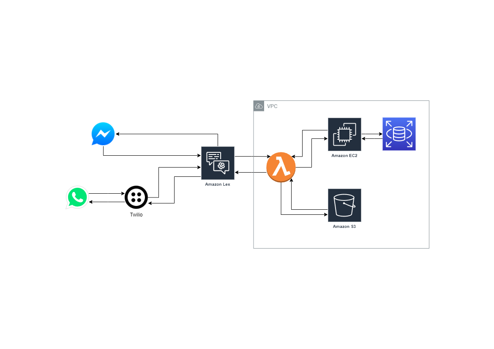

# Coop-Bot-Doc

## Proyectos

[Web App](https://github.com/enramgarcia/uip-app)

[Funciones Lambda](https://github.com/enramgarcia/Coop-Bot)

## Infraestructura



## Web App

Para que el chatbot funcione se tiene que crear el web app que hace la migración de la base de datos y dispone un API para el chatbot. Este web app puede correr en una instancia de Ec2 o se puede crear un ambiente de Elastic Beanstalk que contenga un balanceador de carga, instancias de EC2 y la Base de Datos en un RDS.

```
sudo apt-get update
sudo apt-get upgrade

sudo su

apt install nginx

add-apt-repository ppa:ondrej/php

apt-get update

apt-get install -y php8.2-cli php8.2-common php8.2-fpm php8.2-mysql php8.2-zip php8.2-gd php8.2-mbstring php8.2-curl php8.2-xml php8.2-bcmath

apt install zip unzip

curl -sS https://getcomposer.org/installer | php

cd /var/www

git clone https://github.com/enramgarcia/uip-app.git

apt install npm

chown -R www-data:www-data uip-app

cd /etc/nginx/sites-available

nano default

nginx -t

nano /etc/nginx/sites-available/default

sudo apt-get remove nodejs
curl -fsSL https://deb.nodesource.com/setup_18.x | sudo -E bash -
sudo dpkg -i --force-overwrite /var/cache/apt/archives/nodejs_18.16.0-deb-1nodesource1_amd64.deb
sudo apt -f install
sudo apt update
sudo apt dist-upgrade
```
